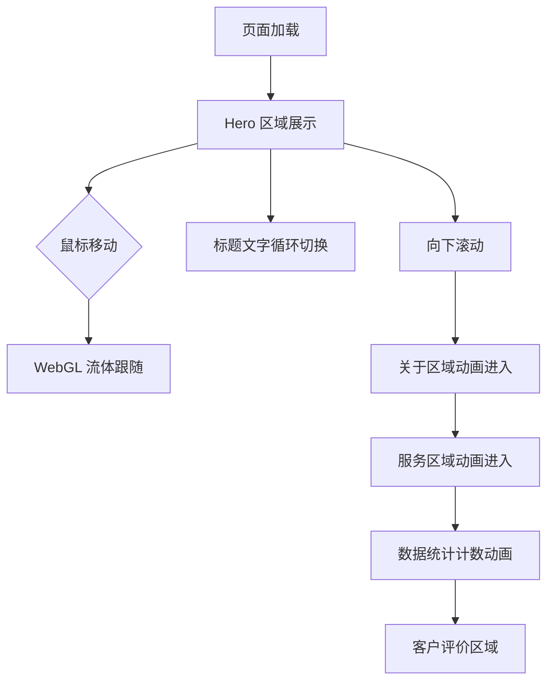

# OCI 网站复刻 - 产品需求文档

## 1. 产品概述

复刻 Buzzworthy Studio 的 OCI 网站主页，实现完全一致的视觉效果和鼠标交互体验。网站采用深色主题配合流畅的 WebGL 动画效果，展现高端创意工作室的品牌形象。

目标用户：潜在客户、设计爱好者、行业合作伙伴
核心价值：通过沉浸式交互体验展示创意设计与技术实力

## 2. 核心功能

### 2.1 页面结构

网站仅包含一个主页，通过滚动展示不同内容区块：

1. **Hero 区域**：全屏展示，包含动态标题和 WebGL 流体动画
2. **关于我们区域**：文字动画展示工作室介绍
3. **服务理念区域**：规则卡片展示工作态度
4. **数据统计区域**：动态数字展示业绩成果
5. **客户评价区域**：轮播展示客户反馈

### 2.2 页面详情

| 页面/区域 | 模块名称 | 功能描述 |
|-----------|----------|----------|
| Hero 区域 | WebGL 流体背景 | 使用 Three.js 创建跟随鼠标移动的流体/blob 动画效果，颜色在蓝紫色调间渐变 |
| Hero 区域 | 动态标题 | 大字号标题 "We" 配合循环切换的文字（Turn Vision into Value / Are A Gateway to Success / Unlock Potential / Feed and Fuel Growth / Amplify Your Message） |
| Hero 区域 | 副标题 | "Creative Web Studio" 文字展示，采用分词动画效果 |
| Hero 区域 | 简介文字 | 工作室简介描述文字，带有渐入动画 |
| 导航栏 | 固定导航 | 顶部固定导航，包含 Logo 和菜单按钮，滚动时透明度变化 |
| 关于区域 | 标题动画 | "About" 标题带有滚动触发的文字揭示效果 |
| 关于区域 | 内容展示 | 工作室介绍文字，分段展示十年经验与专业能力 |
| 关于区域 | CTA 按钮 | "ABOUT US" 按钮，带磁吸悬停效果 |
| 服务区域 | 规则卡片 | 5 张规则卡片（Discipline / Trust / Passion / Devotion / Promise），每张包含编号、标题和描述 |
| 服务区域 | 标题装饰 | "Attitude" 文字重复三次作为视觉装饰 |
| 数据统计 | 动态数字 | 8 组数据统计（Bounce Rate / Signups / Bookings 等），数字带有滚动触发的计数动画 |
| 客户评价 | 评价卡片 | 客户评价轮播，包含客户头像、姓名职位和评价内容 |
| 客户评价 | 导航指示 | 评价区域的导航点或箭头控制 |
| 全局 | 自定义光标 | 圆形自定义光标，悬停交互元素时放大并显示 "View" 文字 |
| 全局 | 平滑滚动 | 使用 Lenis 实现流畅的滚动体验 |

## 3. 核心流程

用户进入网站后，首先看到 Hero 区域的 WebGL 流体动画和动态标题。随着用户向下滚动，各区域内容依次以动画形式呈现。用户可以通过鼠标移动与 WebGL 背景产生交互，悬停在按钮和卡片上时触发动画效果。

## 4. 用户界面设计

### 4.1 设计规范

**色彩系统**
- 主背景色：#0a0a0a（深黑色）
- 次背景色：#111111（卡片背景）
- 主文字色：#ffffff（纯白）
- 次文字色：#888888（灰色）
- 强调色：#6366f1（靛蓝）到 #a855f7（紫色）渐变
- WebGL 流体色：蓝紫色调，随鼠标位置变化

**字体规范**
- 主字体：Inter 或系统无衬线字体
- Hero 标题：超大字号（80-120px），粗体
- 正文：16-18px，常规字重
- 小标题：24-32px，中等字重

**按钮样式**
- 圆角：50px（胶囊形状）
- 边框：1px solid rgba(255,255,255,0.2)
- 背景：透明或半透明
- 悬停：背景填充 + 文字颜色反转

**布局风格**
- 全屏区块设计
- 大量留白
- 居中对齐的 Hero 内容
- 左侧对齐的内容区域

**图标风格**
- 线性图标
- 1.5px 描边
- 圆角端点

### 4.2 页面设计详述

| 区域 | 模块 | UI 元素 |
|------|------|---------|
| Hero | 背景 | WebGL Canvas 全屏覆盖，流体效果使用 GLSL Shader 实现，颜色在 #4f46e5 到 #9333ea 间渐变 |
| Hero | 标题 | "We" 文字固定，下方文字循环切换，使用 GSAP SplitText 实现字符级动画 |
| Hero | 副标题 | "Creative" 和 "Web Studio" 分行展示，带渐入动画 |
| Hero | 简介 | 最大宽度 600px，居中对齐，透明度从 0 到 1 的渐入 |
| 导航 | 顶部栏 | 固定定位，背景模糊效果（backdrop-filter: blur(10px)），滚动后显示 |
| 关于 | 标题 | "About" 大字，使用 clip-path 或 mask 实现文字揭示动画 |
| 关于 | 内容 | 两列布局，左侧文字描述，右侧 CTA 按钮 |
| 服务 | 规则卡片 | 垂直列表，每张卡片带左侧边框高亮，悬停时边框颜色变化 |
| 服务 | 装饰文字 | "Attitude" 重复三次，透明度递减，营造层次感 |
| 数据 | 统计项 | 网格布局，数字使用等宽字体，大字号（48-64px），带计数动画 |
| 评价 | 卡片 | 白色背景，圆角 16px，阴影效果，包含引号装饰 |

### 4.3 响应式设计

- 桌面优先设计（1440px+ 为基准）
- 平板适配（768px-1439px）：调整字号和间距
- 移动端（<768px）：简化 WebGL 效果，改为 CSS 渐变背景以确保性能

### 4.4 鼠标交互设计

**自定义光标**
- 默认状态：20px 圆形，白色边框，透明填充
- 悬停状态：放大至 60px，显示 "View" 文字
- 跟随鼠标：使用 requestAnimationFrame 实现平滑跟随，带延迟效果

**WebGL 流体交互**
- 鼠标位置影响流体变形中心点
- 鼠标移动速度影响流体扰动强度
- 点击时产生涟漪扩散效果

**磁吸按钮效果**
- 按钮在 50px 范围内感应鼠标
- 按钮向鼠标方向轻微位移（最大 10px）
- 使用 GSAP 实现弹性缓动

**卡片悬停**
- 轻微上移（translateY -8px）
- 阴影加深
- 边框高亮

## 5. 动画规范

### 5.1 入场动画

| 元素 | 动画效果 | 时长 | 缓动函数 |
|------|----------|------|----------|
| Hero 标题 | 从下方滑入 + 透明度变化 | 1.2s | power3.out |
| Hero 副标题 | 字符逐个淡入 | 0.8s | power2.out |
| 区域标题 | 文字揭示（clip-path） | 1s | power3.inOut |
| 内容卡片 | 从下方滑入 + 透明度 | 0.6s | power2.out |
| 统计数字 | 从 0 计数到目标值 | 2s | power2.out |

### 5.2 滚动触发动画

- 使用 GSAP ScrollTrigger
- 触发点：元素进入视口 20% 时
- 动画：淡入 + 轻微位移
- 错开时间：多个元素间延迟 0.1s

### 5.3 持续动画

- WebGL 流体：持续波动，帧率 60fps
- 标题切换：每 3 秒切换一次，带淡入淡出
- 装饰元素：轻微浮动动画（上下 10px，4s 周期）
