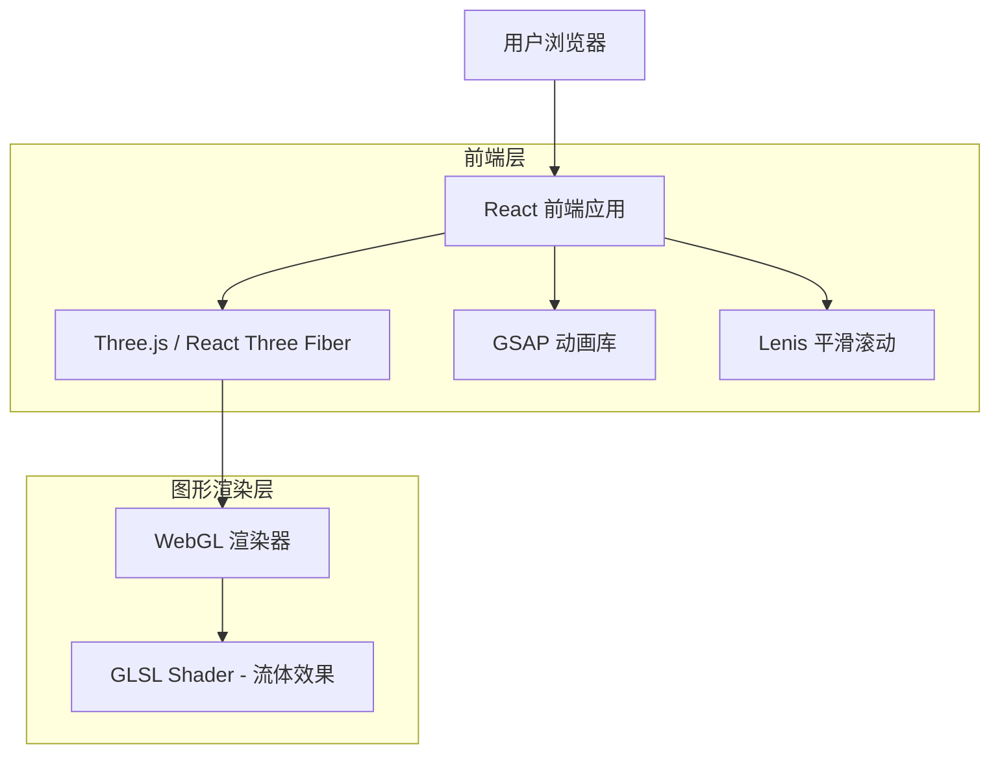

# OCI 网站复刻 - 技术架构文档

## 1. 架构设计



## 2. 技术描述

* **前端框架**: React\@18 + TypeScript\@5

* **构建工具**: Vite\@5

* **样式方案**: Tailwind CSS\@3

* **3D 渲染**: Three.js\@0.160 + @react-three/fiber\@8 + @react-three/drei\@9

* **动画库**: GSAP\@3 + @gsap/react

* **平滑滚动**: Lenis\@1

* **字体**: Inter (Google Fonts)

## 3. 路由定义

本项目为单页应用，仅包含一个主页路由：

| 路由 | 用途          |
| -- | ----------- |
| /  | 主页，包含所有内容区域 |

## 4. 组件架构

### 4.1 组件层级

```
App
├── CustomCursor          # 自定义光标组件
├── SmoothScroll          # Lenis 平滑滚动包装器
├── Navigation            # 导航栏
├── Hero                  # Hero 区域
│   ├── WebGLBackground   # WebGL 流体背景
│   ├── AnimatedTitle     # 动态标题组件
│   └── IntroText         # 简介文字
├── About                 # 关于区域
│   ├── SectionTitle      # 区域标题（复用）
│   └── ContentBlock      # 内容块
├── Services              # 服务/规则区域
│   ├── AttitudeText      # 装饰文字
│   └── RuleCard          # 规则卡片
├── Statistics            # 数据统计区域
│   └── StatItem          # 统计项
└── Testimonials          # 客户评价区域
    └── TestimonialCard   # 评价卡片
```

### 4.2 核心组件接口

**WebGLBackground Props**

```typescript
interface WebGLBackgroundProps {
  mousePosition: { x: number; y: number };
  scrollProgress: number;
}
```

**AnimatedTitle Props**

```typescript
interface AnimatedTitleProps {
  words: string[];
  interval?: number; // 切换间隔，默认 3000ms
}
```

**SectionTitle Props**

```typescript
interface SectionTitleProps {
  title: string;
  triggerOnScroll?: boolean;
}
```

**RuleCard Props**

```typescript
interface RuleCardProps {
  number: string; // "RULE NO.1"
  title: string;
  description: string;
  index: number; // 用于错开动画
}
```

**StatItem Props**

```typescript
interface StatItemProps {
  value: number;
  suffix?: string; // "%", "K" 等
  label: string;
}
```

## 5. WebGL 流体效果实现

### 5.1 Shader 结构

**顶点着色器 (vertex.glsl)**

```glsl
varying vec2 vUv;

void main() {
  vUv = uv;
  gl_Position = projectionMatrix * modelViewMatrix * vec4(position, 1.0);
}
```

**片元着色器 (fragment.glsl)**

```glsl
uniform float uTime;
uniform vec2 uMouse;
uniform vec2 uResolution;
uniform float uScrollProgress;

varying vec2 vUv;

// 噪声函数
float noise(vec2 p) {
  return fract(sin(dot(p, vec2(12.9898, 78.233))) * 43758.5453);
}

// 平滑噪声
float smoothNoise(vec2 p) {
  vec2 i = floor(p);
  vec2 f = fract(p);
  f = f * f * (3.0 - 2.0 * f);
  
  float a = noise(i);
  float b = noise(i + vec2(1.0, 0.0));
  float c = noise(i + vec2(0.0, 1.0));
  float d = noise(i + vec2(1.0, 1.0));
  
  return mix(mix(a, b, f.x), mix(c, d, f.x), f.y);
}

// FBM (分形布朗运动)
float fbm(vec2 p) {
  float value = 0.0;
  float amplitude = 0.5;
  
  for (int i = 0; i < 5; i++) {
    value += amplitude * smoothNoise(p);
    p *= 2.0;
    amplitude *= 0.5;
  }
  
  return value;
}

void main() {
  vec2 uv = vUv;
  vec2 mouseInfluence = (uMouse - 0.5) * 0.3;
  
  // 创建流动效果
  float flow = fbm(uv * 3.0 + uTime * 0.1 + mouseInfluence);
  
  // 颜色渐变：蓝紫色调
  vec3 color1 = vec3(0.31, 0.27, 0.90); // #4f46e5
  vec3 color2 = vec3(0.58, 0.20, 0.92); // #9333ea
  vec3 color3 = vec3(0.20, 0.15, 0.60); // 深蓝紫
  
  vec3 finalColor = mix(color1, color2, flow);
  finalColor = mix(finalColor, color3, fbm(uv * 2.0 - uTime * 0.05) * 0.5);
  
  // 鼠标位置产生高亮
  float mouseDist = distance(uv, uMouse);
  float mouseGlow = smoothstep(0.5, 0.0, mouseDist) * 0.3;
  finalColor += vec3(mouseGlow);
  
  gl_FragColor = vec4(finalColor, 1.0);
}
```

### 5.2 React Three Fiber 组件

```typescript
import { Canvas, useFrame, useThree } from '@react-three/fiber';
import { useRef, useMemo } from 'react';
import * as THREE from 'three';

function FluidMesh({ mousePosition }: { mousePosition: { x: number; y: number } }) {
  const meshRef = useRef<THREE.Mesh>(null);
  const { viewport } = useThree();
  
  const uniforms = useMemo(() => ({
    uTime: { value: 0 },
    uMouse: { value: new THREE.Vector2(0.5, 0.5) },
    uResolution: { value: new THREE.Vector2(window.innerWidth, window.innerHeight) },
    uScrollProgress: { value: 0 }
  }), []);
  
  useFrame((state) => {
    if (meshRef.current) {
      const material = meshRef.current.material as THREE.ShaderMaterial;
      material.uniforms.uTime.value = state.clock.elapsedTime;
      material.uniforms.uMouse.value.set(mousePosition.x, mousePosition.y);
    }
  });
  
  return (
    <mesh ref={meshRef} scale={[viewport.width, viewport.height, 1]}>
      <planeGeometry args={[1, 1, 32, 32]} />
      <shaderMaterial
        vertexShader={vertexShader}
        fragmentShader={fragmentShader}
        uniforms={uniforms}
      />
    </mesh>
  );
}
```

## 6. 动画实现方案

### 6.1 GSAP ScrollTrigger 配置

```typescript
import { gsap } from 'gsap';
import { ScrollTrigger } from 'gsap/ScrollTrigger';

gsap.registerPlugin(ScrollTrigger);

// 区域入场动画
const createSectionAnimation = (sectionRef: HTMLElement) => {
  gsap.fromTo(
    sectionRef,
    { opacity: 0, y: 50 },
    {
      opacity: 1,
      y: 0,
      duration: 0.8,
      ease: 'power2.out',
      scrollTrigger: {
        trigger: sectionRef,
        start: 'top 80%',
        toggleActions: 'play none none reverse'
      }
    }
  );
};

// 文字揭示动画
const createTextReveal = (textRef: HTMLElement) => {
  gsap.fromTo(
    textRef,
    { clipPath: 'inset(0 100% 0 0)' },
    {
      clipPath: 'inset(0 0% 0 0)',
      duration: 1,
      ease: 'power3.inOut',
      scrollTrigger: {
        trigger: textRef,
        start: 'top 75%'
      }
    }
  );
};

// 数字计数动画
const createCountUp = (element: HTMLElement, targetValue: number) => {
  gsap.fromTo(
    { value: 0 },
    { value: targetValue },
    {
      duration: 2,
      ease: 'power2.out',
      scrollTrigger: {
        trigger: element,
        start: 'top 85%'
      },
      onUpdate: function() {
        element.textContent = Math.floor(this.targets()[0].value).toString();
      }
    }
  );
};
```

### 6.2 自定义光标实现

```typescript
import { useEffect, useRef } from 'react';
import { gsap } from 'gsap';

function CustomCursor() {
  const cursorRef = useRef<HTMLDivElement>(null);
  const cursorTextRef = useRef<HTMLSpanElement>(null);
  
  useEffect(() => {
    const cursor = cursorRef.current;
    if (!cursor) return;
    
    const onMouseMove = (e: MouseEvent) => {
      gsap.to(cursor, {
        x: e.clientX,
        y: e.clientY,
        duration: 0.5,
        ease: 'power3.out'
      });
    };
    
    const onMouseEnterInteractive = () => {
      gsap.to(cursor, {
        scale: 3,
        duration: 0.3,
        ease: 'power2.out'
      });
      if (cursorTextRef.current) {
        cursorTextRef.current.style.opacity = '1';
      }
    };
    
    const onMouseLeaveInteractive = () => {
      gsap.to(cursor, {
        scale: 1,
        duration: 0.3,
        ease: 'power2.out'
      });
      if (cursorTextRef.current) {
        cursorTextRef.current.style.opacity = '0';
      }
    };
    
    window.addEventListener('mousemove', onMouseMove);
    
    // 为所有交互元素添加事件监听
    const interactiveElements = document.querySelectorAll('a, button, [data-cursor-hover]');
    interactiveElements.forEach(el => {
      el.addEventListener('mouseenter', onMouseEnterInteractive);
      el.addEventListener('mouseleave', onMouseLeaveInteractive);
    });
    
    return () => {
      window.removeEventListener('mousemove', onMouseMove);
      interactiveElements.forEach(el => {
        el.removeEventListener('mouseenter', onMouseEnterInteractive);
        el.removeEventListener('mouseleave', onMouseLeaveInteractive);
      });
    };
  }, []);
  
  return (
    <div
      ref={cursorRef}
      className="fixed w-5 h-5 pointer-events-none z-[9999] -translate-x-1/2 -translate-y-1/2 mix-blend-difference"
    >
      <div className="w-full h-full rounded-full border border-white flex items-center justify-center">
        <span ref={cursorTextRef} className="text-[8px] text-white opacity-0 transition-opacity">
          View
        </span>
      </div>
    </div>
  );
}
```

### 6.3 磁吸按钮效果

```typescript
function MagneticButton({ children }: { children: React.ReactNode }) {
  const buttonRef = useRef<HTMLButtonElement>(null);
  
  useEffect(() => {
    const button = buttonRef.current;
    if (!button) return;
    
    const handleMouseMove = (e: MouseEvent) => {
      const rect = button.getBoundingClientRect();
      const x = e.clientX - rect.left - rect.width / 2;
      const y = e.clientY - rect.top - rect.height / 2;
      
      gsap.to(button, {
        x: x * 0.3,
        y: y * 0.3,
        duration: 0.3,
        ease: 'power2.out'
      });
    };
    
    const handleMouseLeave = () => {
      gsap.to(button, {
        x: 0,
        y: 0,
        duration: 0.5,
        ease: 'elastic.out(1, 0.3)'
      });
    };
    
    button.addEventListener('mousemove', handleMouseMove);
    button.addEventListener('mouseleave', handleMouseLeave);
    
    return () => {
      button.removeEventListener('mousemove', handleMouseMove);
      button.removeEventListener('mouseleave', handleMouseLeave);
    };
  }, []);
  
  return (
    <button ref={buttonRef} className="magnetic-button">
      {children}
    </button>
  );
}
```

## 7. 项目文件结构

```
src/
├── components/
│   ├── CustomCursor.tsx
│   ├── Navigation.tsx
│   ├── SmoothScroll.tsx
│   ├── sections/
│   │   ├── Hero.tsx
│   │   ├── About.tsx
│   │   ├── Services.tsx
│   │   ├── Statistics.tsx
│   │   └── Testimonials.tsx
│   └── ui/
│       ├── AnimatedTitle.tsx
│       ├── SectionTitle.tsx
│       ├── RuleCard.tsx
│       ├── StatItem.tsx
│       ├── TestimonialCard.tsx
│       └── MagneticButton.tsx
├── hooks/
│   ├── useMousePosition.ts
│   ├── useScrollProgress.ts
│   └── useInView.ts
├── shaders/
│   ├── fluid/
│   │   ├── vertex.glsl
│   │   └── fragment.glsl
│   └── index.ts
├── styles/
│   └── globals.css
├── utils/
│   └── animations.ts
├── App.tsx
└── main.tsx
```

## 8. 性能优化策略

1. **WebGL 优化**

   * 使用合理的几何体细分（32x32 段）

   * 限制帧率为 60fps

   * 在移动端降级为 CSS 渐变背景

2. **动画优化**

   * 使用 `will-change` 属性提示浏览器优化

   * 使用 `transform` 和 `opacity` 进行动画（GPU 加速）

   * 使用 GSAP 的 `force3D: true` 选项

3. **滚动优化**

   * 使用 Lenis 的 `lerp` 选项控制平滑度

   * 使用 `requestAnimationFrame` 进行滚动监听

   * 防抖处理 resize 事件

4. **代码分割**

   * WebGL 组件懒加载

   * 非首屏组件延迟加载

## 9. 依赖列表

```json
{
  "dependencies": {
    "react": "^18.2.0",
    "react-dom": "^18.2.0",
    "three": "^0.160.0",
    "@react-three/fiber": "^8.15.0",
    "@react-three/drei": "^9.92.0",
    "gsap": "^3.12.0",
    "@gsap/react": "^2.1.0",
    "lenis": "^1.0.0",
    "clsx": "^2.0.0",
    "tailwind-merge": "^2.0.0"
  },
  "devDependencies": {
    "@types/react": "^18.2.0",
    "@types/react-dom": "^18.2.0",
    "@types/three": "^0.160.0",
    "@vitejs/plugin-react": "^4.2.0",
    "autoprefixer": "^10.4.0",
    "postcss": "^8.4.0",
    "tailwindcss": "^3.4.0",
    "typescript": "^5.3.0",
    "vite": "^5.0.0",
    "vite-plugin-glsl": "^1.2.0"
  }
}
```

